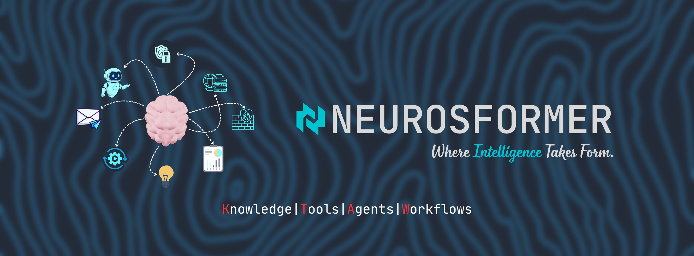

# Neurosformer

**AI workflow intelligence for document-heavy, compliance-heavy, and decision-heavy industries.**

  

Neurosformer builds secure AI systems that help organizations turn unstructured information into structured workflows, reviewable decisions, and auditable operations.

Our focus is not generic AI demos. We build practical AI products around real operational pain: documents, compliance, traceability, clinical documentation, crop risk, evidence review, and human-in-the-loop workflow automation.

## Principles

- Build workflow products, not isolated AI chatbots
- Keep humans in the loop for high-risk decisions
- Show citations, confidence, and source evidence
- Design for privacy, security, and auditability from the beginning
- Start narrow, validate with real users, then expand
- Prefer practical business value over model hype

## Contact

- Website: [neurosformer.dev](https://neurosformer.dev/)
- Email: [neurosformer@gmail.com](mailto:neurosformer@gmail.com)
- GitHub: [github.com/Neurosformer](https://github.com/Neurosformer)
